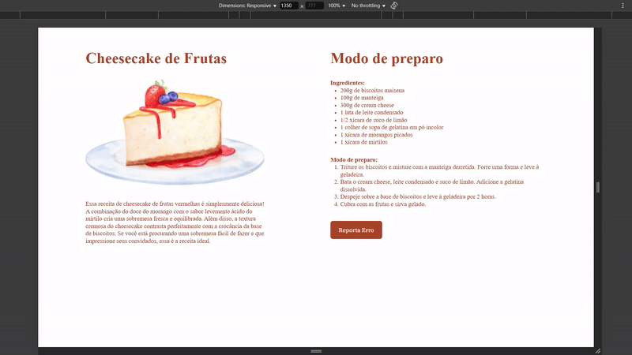

# Projeto - Cheesecake

> Este é um exemplo de uma página HTML responsiva que apresenta a receita de um delicioso cheesecake de frutas vermelhas. A página fornece detalhes sobre os ingredientes necessários, o modo de preparo e uma breve descrição da sobremesa. Além disso, inclui uma imagem ilustrativa do cheesecake e um botão para relatar erros ou problemas na receita. Esse é um projeto feito com orientação da Rocketseat durante a formação Explorer, o intuito desse projeto é reforçar o tema de Responsividade dentro de uma aplicação web.

## Funcionalidades

- **Receita Detalhada:**: A página apresenta uma descrição detalhada da receita de cheesecake de frutas vermelhas, incluindo os ingredientes necessários e o modo de preparo passo a passo.

- **Imagem Ilustrativa:**: Uma imagem ilustrativa do cheesecake é exibida para dar aos usuários uma ideia visual da sobremesa final.

- **Botão de Relatório de Erro:**: Um botão "Reportar Erro" permite que os usuários relatem problemas ou erros encontrados na receita, fornecendo um meio de feedback para melhorias futuras.
## Stack utilizada

**Front-end:** HTML, CSS

## Aprendizados

- clamp para página com muitos breakpoints ou para maior flexibilidade de fontes

